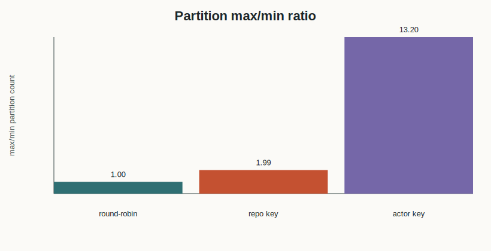
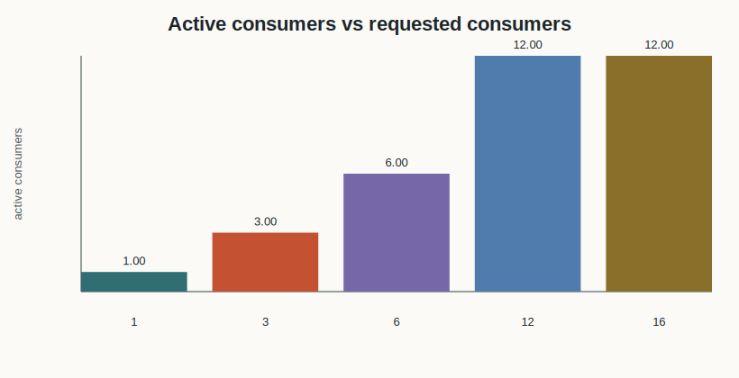
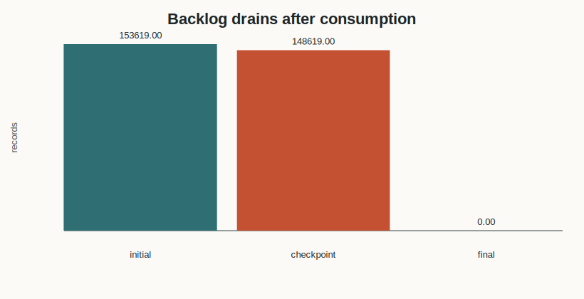

# Kafka Demo Lab Result

This report was generated by a Docker Compose run against a real Kafka broker. The input data is the fixed GH Archive hour `2024-01-01-0.json.gz`; the experiment downloads that public archive, verifies MD5 `d4bd9ce833f217e95ffb3fd958138827`, parses every event, produces the events to Kafka, consumes them back, and then writes these measurements. The numbers below are not hand-written expected output.

## Dataset

| Metric | Value |
| --- | ---: |
| Source URL | https://data.gharchive.org/2024-01-01-0.json.gz |
| Compressed bytes | 74527660 |
| Event records | 153619 |
| Distinct event types | 15 |
| Distinct repositories | 59010 |
| Distinct actors | 18973 |
| Time range start | 2024-01-01T00:00:00Z |
| Time range end | 2024-01-01T00:59:59Z |

Top event types: PushEvent=110370, CreateEvent=12107, PullRequestEvent=9613, IssueCommentEvent=7161, IssuesEvent=3964

Top repositories by event count: dim12512a/Repo8=3514, appref5555ix63/Repo4=3497, dim12512a/Repo5=3482, appref5555ix63/Repo3=3478, dim12512a/Repo6=3473

Top actors by event count: github-actions[bot]=41916, dim12512a=13903, appref5555ix63=13650, dependabot[bot]=7117, renovate[bot]=4874

The dataset is representative for a Kafka lab because it is an append-only event stream with natural event ids, event types, actor ids, repository ids, skewed keys, and one-hour ordering semantics.

## Partitioning And Ordering

| Scenario | Records consumed | Partitions used | Min partition count | Max partition count | Max/min ratio | Key partition violations | Per-key order violations |
| --- | ---: | ---: | ---: | ---: | ---: | ---: | ---: |
| Round-robin/no key | 153619 | 12 | 12801 | 12802 | 1.0001 | 0 | 0 |
| Key = repo.id | 153619 | 12 | 8764 | 17405 | 1.9860 | 0 | 0 |
| Key = actor.id | 153619 | 12 | 4584 | 60528 | 13.2042 | 0 | 0 |

Round-robin production spreads records across all 12 partitions with nearly equal counts. Keyed production also uses all partitions, but real-world key skew changes partition load. The verifier checks that each `repo.id` or `actor.id` stays on one partition and that the per-key sequence consumed from Kafka remains ordered.

## Consumer Group Parallelism

| Requested consumers | Active consumers | Topic partitions | Records consumed |
| ---: | ---: | ---: | ---: |
| 1 | 1 | 12 | 1200 |
| 3 | 3 | 12 | 1200 |
| 6 | 6 | 12 | 1200 |
| 12 | 12 | 12 | 1200 |
| 16 | 12 | 12 | 1200 |

Kafka consumer group parallelism is bounded by partition count. When the requested consumer count exceeds 12 partitions, extra consumers do not receive records in this run.

## Lag Drain

| Measurement | Records |
| --- | ---: |
| Initial backlog after production | 153619 |
| Consumed at checkpoint | 5000 |
| Backlog at checkpoint | 148619 |
| Final backlog after drain | 0 |

The lag scenario uses the produced `repo.id` keyed topic as the backlog. The consumer starts behind the producer, observes a non-zero backlog, and drains it to zero after reading all produced records.

## Conclusion

- Kafka partitions are the unit of parallelism. More consumers than partitions do not increase active parallelism for one topic.
- A key maps all records for the same entity to one partition, which preserves per-key order but can create partition skew when the real traffic distribution is skewed.
- Consumer lag is accumulated produced-but-unconsumed records. It falls to zero only when consumers catch up with the topic offsets.
