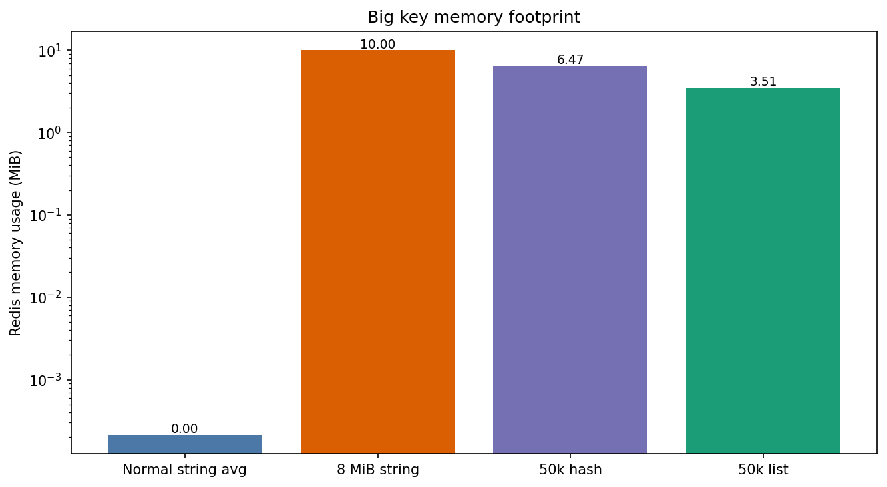
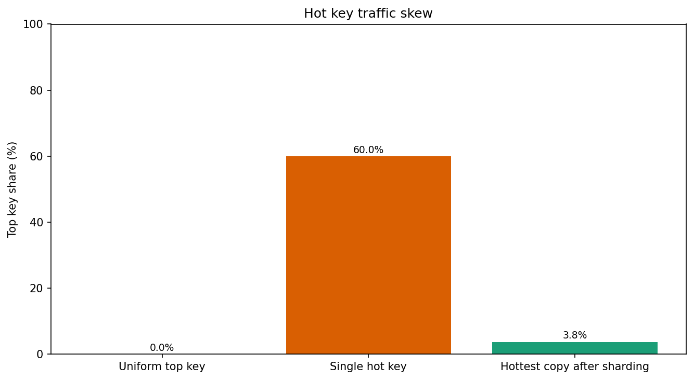
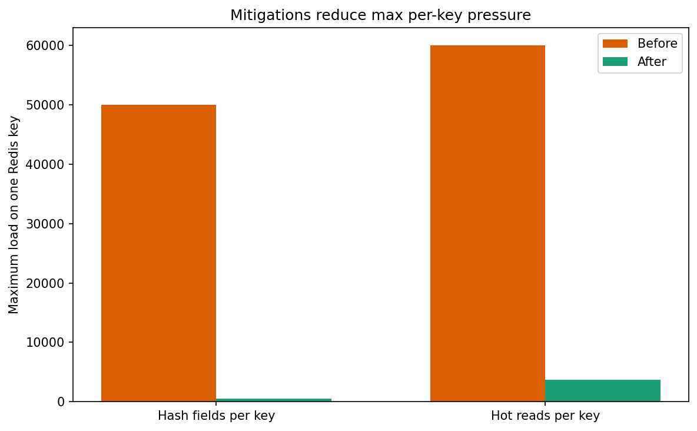

# Redis 大 Key 与热点 Key 实验结果

本文档由真实的 Docker Compose 实验运行生成。数据集由实验程序在运行时构造并写入 Redis，随后通过 `MEMORY USAGE`、`HLEN`、`LLEN`、`HGETALL`、`HSCAN` 以及真实的 `GET` 访问负载从 Redis 中测量。仓库中记录的数值不是手写夹具，也不是为了结论人为编造的数据。

## 数据集

| 维度 | 数值 |
| --- | ---: |
| 普通字符串 key 数量 | 20000 |
| 普通字符串 value 大小 | 128 bytes |
| 大字符串 value 大小 | 8388608 bytes |
| 大 Hash 字段数 | 50000 |
| 大 List 元素数 | 50000 |
| 热点 Key 访问空间 | 10000 keys |
| 热点 Key 请求数 | 100000 |
| 热点 Key 倾斜比例 | 60% 请求集中到一个逻辑 key |

## 大 Key 实验结果

| 场景 | 测量值 |
| --- | ---: |
| 普通字符串平均内存 | 224 bytes |
| 大字符串内存 | 10485816 bytes |
| 大字符串逻辑长度 | 8388608 bytes |
| 大 Hash 内存 | 6786544 bytes |
| 大 Hash 字段数 | 50000 |
| 大 List 内存 | 3679800 bytes |
| 大 List 元素数 | 50000 |

大字符串、大 Hash 和大 List 都是合法的 Redis 对象，但它们把远高于普通 key 的内存占用和命令处理量集中到了单个 key 上。大 Key 的核心风险不在于 Redis 不能存储它，而在于单个命令、单个 key 的所有权和迁移成本会变得过重。

完整读取 Hash 时，`HGETALL` 在一次命令中返回了 `50000` 个字段。游标扫描同样读取了 `50000` 个字段，但把工作拆成了 `100` 次调用。耗时会受宿主机影响，但命令形态是稳定的：`HGETALL` 会产生一次大响应，`HSCAN` 则允许调用方分片处理。

Hash 拆分方案保留了全部 `50000` 个字段，并把最大 bucket 降到 `500` 个字段，数据分布在 `100` 个 key 上。拆分不会减少总数据量，但会降低单个 key 和单条命令承受的最大压力。

## 热点 Key 实验结果

| 场景 | 访问量最高的 key | 最高访问次数 | 最高访问占比 |
| --- | --- | ---: | ---: |
| 均匀访问 | `item:7732` | 23 | 0.0002 |
| 单热点 key | `item:0000` | 60000 | 0.6000 |
| 热点 key 读副本分片 | `item:hot:00` | 3750 | 0.0375 |

均匀访问负载把读请求分散到 `9999` 个 key 上，因此没有单个 key 占据主导。热点 Key 负载把 `100000` 次请求中的 `60000` 次打到 `item:0000`，从访问计数上直接证明了流量倾斜问题。

读副本分片方案保持同一个逻辑热点数据不变，但把读取分散到 `16` 个物理 key 上。最热的副本收到 `3750` 次读取，而不是原始热点 key 的 `60000` 次读取，从而降低单个 Redis key 的压力。

## 实验结论

- 大 Key 会带来更高的单 key 内存占用和更大的单命令返回载荷；结构拆分和游标扫描可以降低单条命令的最大处理量。
- 热点 Key 本质是流量分布问题；判断依据应重点看最高访问占比，而不只是看延迟。
- 读副本分片可以降低读热点 Key 对单个 Redis key 的压力；写热点 Key 通常还需要计数器分片、异步聚合或其他写入侧拆分方案。
- 耗时数据只作为观察项记录。校验器检查的是稳定不变量：生成数据规模、Redis 基数、内存下限、访问分布和缓解效果。
