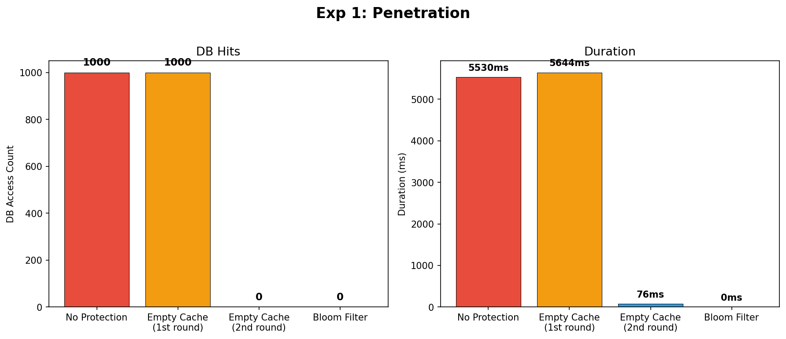
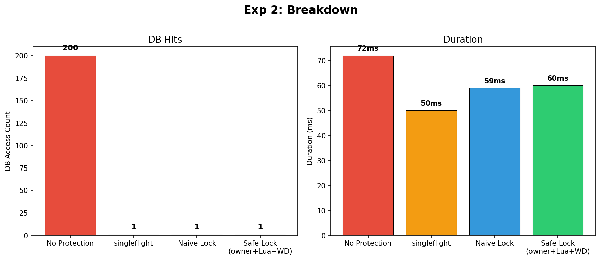
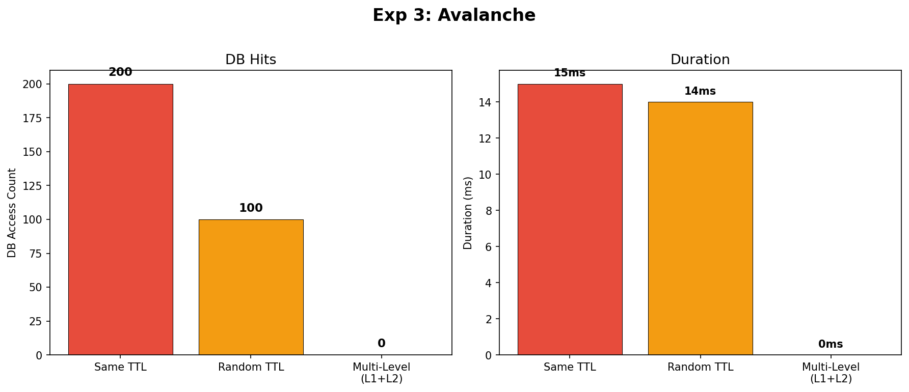
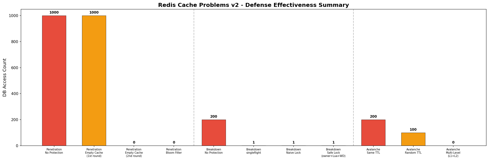

# Redis 缓存三大问题 - 实验报告 v2 (增强版)

> 实验时间: 2026-03-19 07:55:02
> 环境: Docker (Redis 7 Alpine + Go 1.25)
> 增强: 布隆过滤器 / 安全分布式锁(owner+Lua+Watchdog) / 多级缓存(L1+L2)

---

## 概述

| 问题 | 含义 | 基础方案 | 增强方案 |
|------|------|----------|----------|
| 缓存穿透 | 查询不存在的数据，请求直达DB | 缓存空值 | **布隆过滤器前置拦截** |
| 缓存击穿 | 热点key过期瞬间，并发请求打DB | singleflight / 朴素锁 | **安全锁(owner+Lua+看门狗)** |
| 缓存雪崩 | 大批key同时过期 | 随机TTL | **多级缓存(L1本地+L2 Redis)** |

---

## 实验1: 缓存穿透 (Cache Penetration)

**实验设计**: 1000个不存在的用户ID请求



| 方案 | DB访问 | 耗时(ms) | 说明 |
|------|--------|----------|------|
| 无保护 | 1000 | 5530 | 全部穿透 |
| 缓存空值_首轮 | 1000 | 5644 | 全部穿透 |
| 缓存空值_二轮 | 0 | 76 | 全部走缓存 |
| 布隆过滤器 | 0 | 0 | 全部走缓存 |

**布隆过滤器原理**: 多个哈希函数映射到位数组。如果任一位为0，数据**一定不存在**；全部为1，数据**可能存在**（有误判率）。

**生产实践**: 合法数据写入DB时同步 `BF.ADD`，查询前先 `BF.EXISTS`。误判率可控在 0.1%。

**关键区别**: 缓存空值需要每个key穿透一次DB才能建立缓存；布隆过滤器在**应用层内存**中直接拦截，连Redis都不查。

---

## 实验2: 缓存击穿 (Cache Breakdown)

**实验设计**: 200个goroutine并发查询同一个已过期的热点key



| 方案 | DB访问 | 耗时(ms) | 安全性 |
|------|--------|----------|--------|
| 无保护 | 200 | 72 | N/A |
| singleflight | 1 | 50 | 进程内安全 |
| 朴素分布式锁 | 1 | 59 | 有隐患: 可能误删别人的锁 |
| 安全分布式锁 | 1 | 60 | 安全: owner标识+Lua原子释放+看门狗续期 |

**朴素锁 vs 安全锁**:

```
朴素锁 (有bug):
  SET lockKey "1" NX EX 5
  defer DEL lockKey          // 危险! 可能删别人的锁

安全锁 (生产级):
  ownerID = random()
  SET lockKey ownerID NX EX 5
  启动看门狗(每TTL/3续期)
  Lua: if GET(lockKey)==ownerID then DEL   // 原子操作, 只删自己的
```

**朴素锁的三个隐患**:
1. 无owner标识 → A的锁过期后被B抢到，A执行完DEL删的是B的锁
2. 无续期机制 → 业务耗时 > 锁TTL 时，锁提前过期，多个请求同时进入临界区
3. DEL非原子 → GET+判断+DEL之间可能有时间窗口

---

## 实验3: 缓存雪崩 (Cache Avalanche)

**实验设计**: 200个商品key，对比不同防御策略



| 方案 | DB访问 | 耗时(ms) | 说明 |
|------|--------|----------|------|
| 相同TTL | 200 | 15 | 全部同时过期, DB压力最大 |
| 随机TTL | 100 | 14 | 部分key存活, DB压力减半 |
| 多级缓存 | 0 | 0 | L1命中200个, 进一步降低DB压力 |

**多级缓存架构**:
```
请求 → L1(进程内sync.Map, TTL=2s) → L2(Redis, TTL=3s+jitter) → DB
```
- L1 TTL **必须 < L2 TTL**，避免本地缓存比Redis更旧
- L1 即使Redis全挂也能兜底，防止雪崩直接打到DB
- 生产环境用 ristretto/freecache 替代 sync.Map（有容量限制、LRU淘汰）

---

## 综合对比



## 技术选型建议

| 场景 | 推荐方案 | 复杂度 | 面试关注点 |
|------|----------|--------|------------|
| 防穿透(基础) | 缓存空值 | 低 | 空值TTL设多久？占用Redis内存 |
| 防穿透(严格) | 布隆过滤器 + 缓存空值 | 中 | 误判率、数据更新时布隆过滤器怎么同步 |
| 防击穿(单机) | singleflight | 低 | 多实例部署时失效 |
| 防击穿(多实例) | 安全分布式锁 | 中 | owner+Lua+看门狗三件套 |
| 防雪崩(基础) | TTL随机化 | 低 | 随机范围怎么定 |
| 防雪崩(严格) | 随机TTL + 多级缓存 | 中 | L1/L2 TTL关系、容量控制 |

---

*Generated by redis-cache-demo v2 experiment*
