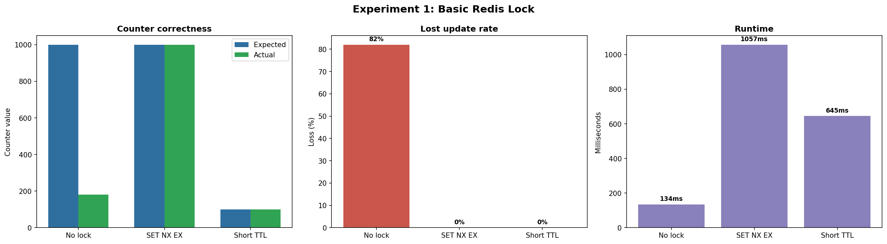
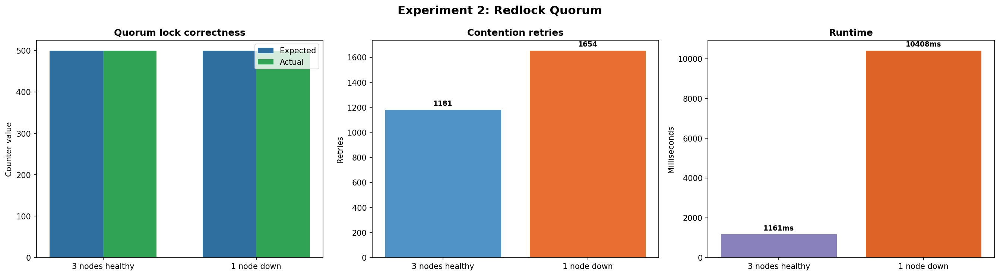
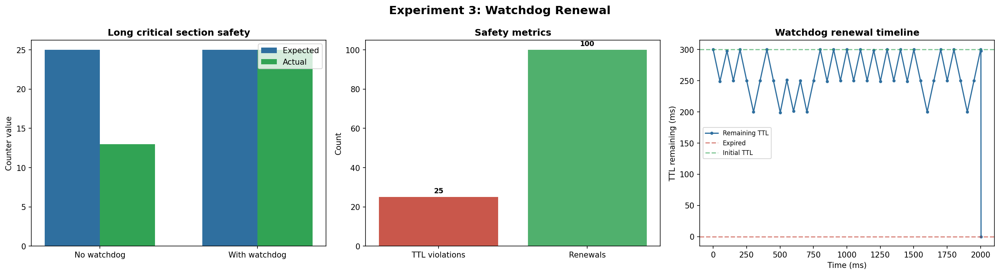

# Redis Distributed Lock Lab Report

This report is generated from a real Docker Compose run. It demonstrates three interview-grade Redis lock topics:

- Basic `SET key value NX EX ttl` locking and safe Lua unlock.
- Redlock quorum behavior with three independent Redis instances.
- Watchdog renewal for critical sections that run longer than the initial lock TTL.

Durations and retry counts are intentionally treated as host-dependent observations. The verifier checks stable theory invariants and bounded outcomes.

## Environment

| Component | Value |
| --- | --- |
| Runtime | Docker Compose |
| Redis | 3 independent Redis 7 instances |
| Language | Go |
| Client | go-redis/v9 |
| Analysis | Python, matplotlib, numpy |

## Experiment 1: Basic Lock

`SET NX EX` protects a read-modify-write counter. The short-TTL variant shows that an expired lock can lose ownership before the critical section finishes.

| Mode | Expected | Actual | Lost | Loss % | Extra | Duration |
| --- | ---: | ---: | ---: | ---: | --- | ---: |
| no_lock | 1000 | 180 | 820 | 82.0 | retries=-, wrong_release=- | 134ms |
| set_nx_ex | 1000 | 1000 | 0 | 0.0 | retries=5400, wrong_release=- | 1057ms |
| short_ttl | 100 | 100 | 0 | 0.0 | retries=-, wrong_release=100 | 645ms |

Expected conclusion: no lock loses updates, `SET NX EX` keeps the counter exact, and a TTL shorter than the critical section is unsafe even when a run happens not to lose counter increments.

## Experiment 2: Redlock

Redlock takes a majority vote across independent Redis instances. With 3 nodes, quorum is 2, so one unreachable node can be tolerated.

| Mode | Alive nodes | Quorum | Expected | Actual | Lost | Retries | Duration |
| --- | ---: | ---: | ---: | ---: | ---: | ---: | ---: |
| redlock_3_node | 3/3 | 2 | 500 | 500 | 0 | 1181 | 1161ms |
| redlock_1_node_down | 2/3 | 2 | 500 | 500 | 0 | 1654 | 10408ms |

Expected conclusion: both Redlock scenarios keep the counter exact; the simulated failed node increases latency and retries but still satisfies quorum.

## Experiment 3: Watchdog

The watchdog renews the lock every `ttl/3` while the owner is alive, preventing the lock from expiring during long work.

| Mode | Lock TTL | Work time | Expected | Actual | Lost | Safety metric | Duration |
| --- | ---: | ---: | ---: | ---: | ---: | --- | ---: |
| no_watchdog | 500ms | 800ms | 25 | 13 | 12 | violations=25 | 12957ms |
| with_watchdog | 500ms | 800ms | 25 | 25 | 0 | renewals=100 | 20081ms |

Timeline renewals: 20; sampled events: 43.

Expected conclusion: without watchdog renewal, the lock expires during work and multiple workers enter the critical section; with watchdog renewal, the counter stays exact.

## Interview Takeaways

- Correct Redis locks need atomic acquire, bounded TTL, a unique owner value, and Lua-based owner-checked release.
- Redlock improves availability over a single Redis node by requiring `N/2+1` successful lock writes, but it still depends on bounded timing assumptions.
- Watchdog renewal addresses long-running business logic; it is not a replacement for explicit unlock and only works while the lock owner process is alive.
